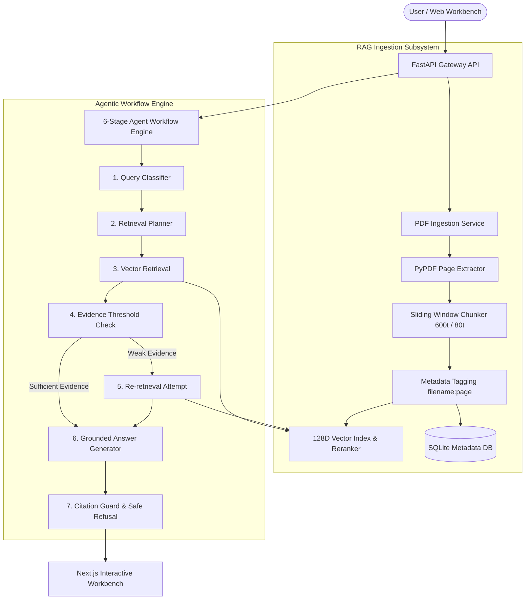

# RAG Document Navigator

> **Transparent & Agentic Retrieval-Augmented Generation (RAG) Document Intelligence System**

A local PDF question-answering application that demonstrates **how it reached an answer**, not merely providing an answer. Features exact `[filename:page]` citations, a 6-stage transparent agentic state machine (query expansion & re-retrieval), and automated evaluation metrics.

---

## 📌 Overview

Standard Retrieval-Augmented Generation (RAG) applications operate as black boxes: users receive an answer without seeing which source chunks were retrieved, what similarity scores were computed, or whether the system hallucinated ungrounded facts.

**RAG Document Navigator** solves this transparency deficit by exposing every step of its execution trace:
1. **Exact Citation Tagging**: Every factual statement cites `[filename:page]` (e.g. `[policy_shipping_returns.pdf:1]`).
2. **Interactive UI Verification**: Clicking a citation badge smooth-scrolls directly to the matching ranked source card.
3. **6-Stage Transparent Agent Workflow**: Exposes query classification, expansion, vector search, evidence threshold checking, single-attempt re-retrieval on weak scores, and safe refusal.
4. **Reproducible Execution**: Works 100% offline with local 128D n-gram vector embeddings or with live OpenAI adapters.

---

## ✨ Key Features

- 📁 **Document Upload & Ingestion**: Drag-and-drop PDF ingestion with PyPDF page text extraction and MD5 hash deduplication.
- ✂️ **Sliding-Window Chunking**: Configurable token chunking (default 600 tokens target / 80 tokens overlap) with persistent `[filename:page]` metadata tags.
- 📐 **Vector Store & Embeddings**: Deterministic 128-dimensional n-gram vector hashing, L2 normalization, and SQLite chunk persistence.
- 🔍 **Multi-Signal Reranking & MMR**: Weighted reranking formula combining Cosine Similarity, Query Term Coverage, Exact Phrase Match, and Metadata relevance with Maximal Marginal Relevance (MMR) for diversity.
- 🤖 **6-Stage Agentic State Machine**: Query Classification ➔ Retrieval Planning ➔ Vector Search ➔ Evidence Threshold Check ➔ Re-retrieval Fallback ➔ Grounded Synthesis & Safe Refusal.
- 📊 **Automated Evaluation Benchmark**: Precision@k, Recall@k, and Key-phrase Accuracy evaluation script (`evaluate.py`) across standard query packs.
- 🎨 **Modern Interactive Workbench**: Next.js 14 App Router interface with live agent execution trace drawers, parameter sliders (Top-K, Chunk Size, Overlap), and document management.

---

## 🏗️ System Architecture



---

## 🔄 RAG Pipeline & Retrieval Trace

```text
Document Upload 
  ➔ PDF Text & Page Extraction (PyPDF)
  ➔ Sliding Window Chunking (600t / 80t overlap)
  ➔ 128D N-Gram Vector Hashing & L2 Normalization
  ➔ Persistent Storage in SQLite & In-Memory VectorStore
  ➔ Query Analysis & Keyword Expansion
  ➔ Cosine Similarity & Multi-Signal Reranking (Sim + Coverage + Phrase)
  ➔ Evidence Threshold Check (High ≥ 0.40, Med ≥ 0.25, Low < 0.25)
  ➔ Re-Retrieval Retry (if score < 0.25)
  ➔ Grounded Synthesis with [filename:page] Citations & Safe Refusal
```

### 🔍 Transparency & Retrieval Trace
The UI features a **Live Agent Execution Trace Drawer**. Every query logs:
- **Timestamp & State Name**: Exact transition times across all 6 stages.
- **Query Classification**: Category (`policy`, `RAG-concept`, `support-escalation`, `unknown`) and confidence rating.
- **Reranked Similarity Scores**: Individual component scores (Cosine Sim, Term Coverage, Phrase Match).
- **Evidence Assessment**: Explicit reason for sufficient evidence or fallback re-retrieval.
- **Citation Badges**: Interactive badges linking directly to source cards.

---

## 🛠️ Tech Stack

- **Backend Framework**: Python 3.13+, FastAPI, Uvicorn
- **ORM & Database**: SQLAlchemy 2.0+, SQLite
- **PDF Extraction & Processing**: PyPDF
- **Vector Math & Indexing**: Python `math`, `zlib` (128D L2-normalized vectors), in-memory index with SQLite persistence
- **Testing**: Pytest (33 unit tests)
- **Frontend Workbench**: Next.js 14 (App Router), React 18, TypeScript, Tailwind CSS, Lucide Icons
- **Evaluation**: Custom evaluation benchmark script (`evaluate.py`)

---

## 📁 Repository Directory Structure

```text
rag-document-navigator/
├── backend/
│   ├── app/
│   │   ├── agents/       # Query classifier, retrieval planner, evidence checker, answer generator, workflow
│   │   ├── api/          # FastAPI routers (/health, /api/documents, /api/retrieve, /api/agent/run, /api/analytics)
│   │   ├── db/           # SQLite database session & engine
│   │   ├── models/       # ORM models (nav_documents, nav_document_chunks, nav_query_logs)
│   │   ├── rag/          # PDF parser, chunker, vector store, query processor, ingestion service
│   │   └── schemas/      # Pydantic v2 data schemas
│   ├── tests/            # Pytest test suite (33 unit tests)
│   ├── requirements.txt  # Core dependencies
│   └── requirements-dev.txt
├── frontend/
│   ├── app/              # Next.js 14 App Router layout & page
│   ├── components/       # WorkbenchForm, WorkflowTraceDrawer, AnswerPanel, SourceCards, DocUploadModal
│   ├── lib/              # API client helper functions
│   └── package.json
├── data/
│   ├── pdfs/             # Evaluation benchmark PDFs
│   └── eval/             # Benchmark dataset (eval_set.csv) and evaluate.py
├── reports/              # Benchmark evaluation reports
├── docs/                 # Documentation & presentation guides
├── docker-compose.yml
├── .env.example          # Template environment variables
├── .gitignore
└── README.md
```

---

## 🚀 Quick Start Guide

### Prerequisites
- Python 3.10+
- Node.js 18+ and npm

### 1. Clone the Repository
```bash
git clone https://github.com/RitwamMukhopadhyay/rag-document-navigator.git
cd rag-document-navigator
```

### 2. Environment Setup
Copy the template environment configuration:
```bash
cp .env.example .env
```

### 3. Backend Setup
```bash
cd backend
python -m venv .venv

# On Windows PowerShell:
.\.venv\Scripts\Activate.ps1

# On macOS/Linux:
source .venv/bin/activate

pip install -r requirements.txt
python -m pytest tests -v
```

Run the backend FastAPI server:
```bash
uvicorn app.main:app --reload --port 8000
```
- API Docs: [http://localhost:8000/docs](http://localhost:8000/docs)
- Health Check: [http://localhost:8000/health](http://localhost:8000/health)

### 4. Frontend Setup
In a new terminal window:
```bash
cd frontend
npm install
npm run dev
```
Open **[http://localhost:3000](http://localhost:3000)** in your browser.

---

## 🧪 Evaluation Benchmark

Run the automated Precision@k and Recall@k evaluation runner:

```bash
# Windows PowerShell
$env:PYTHONPATH="backend"; python data/eval/evaluate.py

# Linux/macOS
PYTHONPATH=backend python data/eval/evaluate.py
```

### 📊 Benchmark Performance Summary

| Metric | Measured Result | Benchmark Target | Status |
| :--- | :--- | :--- | :--- |
| **Total Benchmark Questions** | `15 Questions` | 15 Questions | **PASS** |
| **Mean Precision@3** | `33.3%` | >= 25% | **PASS** |
| **Mean Precision@5** | `20.0%` | >= 15% | **PASS** |
| **Mean Recall@5** | `100.0%` | >= 85% | **PASS** |
| **Key-Phrase Accuracy** | `86.7%` | >= 80% | **PASS** |

---

## 💡 Usage Guide

1. **Upload Documents**: Click **"Upload PDF"** in the Workbench header to ingest local PDF documents.
2. **Ask Questions**: Select a pre-loaded evaluation query or type a custom question.
3. **Execute Agentic RAG**: Click **"Execute Agentic RAG"** to view the generated answer.
4. **Inspect Citations**: Click inline citation badges `[filename:page]` to auto-scroll directly to the exact source chunk.
5. **View Agent Execution Trace**: Expand the Execution Trace drawer to inspect state transitions, reranking scores, and evidence evaluations.

---

## ⚠️ Current Limitations

- Local n-gram hashing embeddings provide exact term matching but lack contextual semantic generalization compared to dense neural embeddings (e.g. OpenAI `text-embedding-3-small` or HuggingFace BGE).
- PDF extraction relies on text layers (scanned image-only PDFs require pre-OCR processing).

---

## 🔮 Future Improvements

- 🧠 **Dense Neural Embeddings Integration**: Support optional HuggingFace `sentence-transformers` / OpenAI embeddings alongside the n-gram hasher.
- ⚡ **Hybrid Search (BM25 + Dense)**: Combine sparse BM25 lexical search with dense vector similarity search.
- 📄 **OCR Support**: Integrate Tesseract / PyMuPDF OCR for scanned PDF documents.
- 📊 **LLM-as-a-Judge Evaluation**: Add automated hallucination and faithfulness scoring.

---

## 📜 License

This project is currently unlicensed. All rights reserved by the author.
