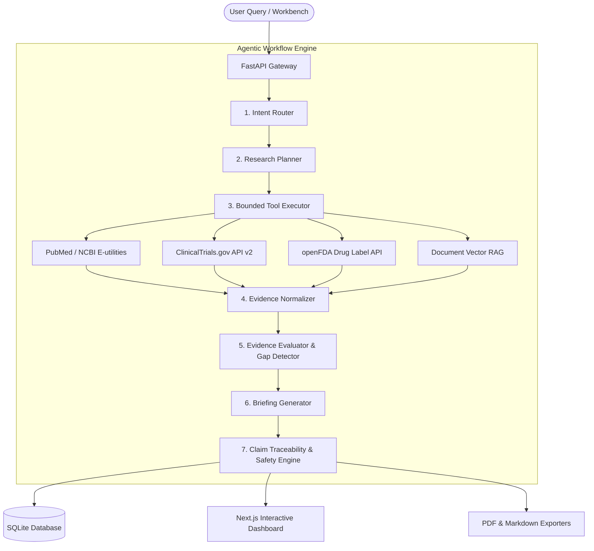

# System Architecture Specification

## Pharma Research & Intelligence Agent

### 1. Architectural Overview

The **Pharma Research & Intelligence Agent** is an agentic, evidence-grounded research assistant designed for pharmaceutical market intelligence, clinical trial landscape discovery, FDA drug safety review, and PDF document retrieval.

Unlike opaque multi-agent swarms or standard probabilistic chat RAG systems, this platform operates a transparent, 6-stage deterministic state machine that logs every tool call, normalizes evidence items into uniform data models, and enforces claim-to-evidence citations (`[E1]`, `[E2]`, `[filename, p. 2]`).



---

## 2. Core Subsystems

### 2.1 Intent Router & Query Planner
- **Intent Router**: Categorizes user research questions into `drug_overview`, `trial_landscape`, `safety_regulatory`, `competitor_comparison`, `literature_review`, or `document_question`.
- **Planner**: Generates focused search terms and selects specific tool integrations.

### 2.2 Public Data Tools & Normalizer
- **PubMed Tool**: Queries NCBI E-utilities for peer-reviewed journal articles, PMIDs, and publication dates.
- **Clinical Trials Tool**: Integrates with ClinicalTrials.gov API v2 to retrieve trial phases, recruitment status, conditions, and NCT IDs.
- **openFDA Tool**: Searches FDA package insert labels for boxed warnings, indications, and adverse reactions.
- **Document RAG Tool**: Page-level vector retrieval over user-uploaded PDF documents using PyPDF extraction and windowed paragraph chunking.
- **Evidence Normalizer**: Converts all raw API responses into a unified `EvidenceItem` schema with standard IDs (`E1`, `E2`...).

### 2.3 Citation Enforcement Engine
- **Traceability Rules**: Every factual paragraph in a generated briefing must cite at least one evidence item tag.
- **Unsupported Claim Detection**: Unsubstantiated statements are automatically flagged and replaced with `"Insufficient evidence retrieved to support this claim."`
- **Confidence Scoring**: Computes a score (0.0 to 1.0) based on source authority weights (FDA=0.98, PubMed=0.92, ClinicalTrials=0.88), volume, recency, and evidence gaps.

---

## 3. Data Model Entity-Relationship Summary

```text
+-----------------------+           +----------------------+
|  ResearchRequest      | 1 ----- 1 |     ResearchPlan     |
+-----------------------+           +----------------------+
| id (PK)               |           | intent               |
| question              |           | selected_tools       |
| drug_name             |           | search_queries       |
| indication            |           +----------------------+
+-----------------------+
        |
        | 1
        |
        v N
+-----------------------+           +----------------------+
|     EvidenceItem      | N ----- 1 |    ResearchBriefing  |
+-----------------------+           +----------------------+
| id (PK) e.g. E1       |           | id (PK)              |
| source_type           |           | executive_summary    |
| title, excerpt        |           | confidence_score     |
| url, source_id        |           | limitations          |
+-----------------------+           +----------------------+
        ^                                   |
        | 1                                 | 1
        |                                   v N
+-----------------------+           +----------------------+
|       Citation        | N ----- 1 |   BriefingSection    |
+-----------------------+           +----------------------+
| evidence_id (FK)      |           | title, content       |
| section_id (FK)       |           | section_type         |
| citation_label        |           +----------------------+
+-----------------------+
```
